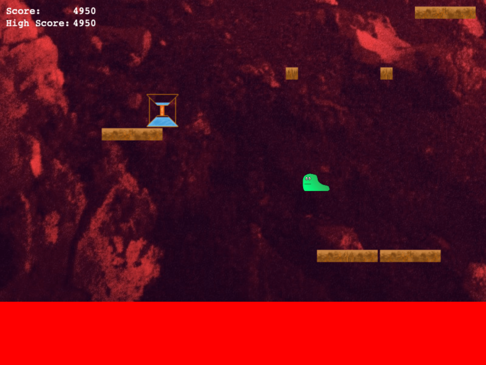

# Lava Escape

A jump game made using Phaser 3 and TypeScript.

## Features
- Basic jump game mechanics
    - Left and right directional movement
    - Upward force applied to player when they hit top of platform
    - Score is calculated based on how high up the player is, the higher they go the higher the points
- Hold down space bar to hold jump and increase jump height
- Procedural chunks of platforms are generated for the player to jump on
    - 3 different types of chunks provide different types and configurations of platforms
- Speed of lava wraps to speed of player
    - Lava is faster the further away it is from the player
- Lava will also generally speed up over time
- Lava dial item pickups decrease the lava height and temporarily slow it down
- Vertical scrolling background that loops back to bottom
- High score functionality

## Setup
1. Clone the repository by running `git clone https://github.com/Coteh/LavaEscape.git`
1. Run in development mode (with debug mode enabled) by running `npm run dev`
1. To build for production, run `npm run prod` and then serve a HTTP server from the project root

## Limitations
- No background music at the moment due to (self-imposed) time constraints
- No high score table at the moment either
- Not everything in the codebase has been modularized yet (e.g. cooldowns)
- No automated testing

## Future Additions
- Reintroduce the broken platform type (a platform that breaks when player steps on it)
- Give player ability to wrap around stage
- Add background music
- Add high score table with ability to submit name
- Revamp chunking system to provide more variety of platforms
- Pickup that allows player to jump higher (like holding space to charge jump but no time needed to charge)
- Adjust game balance (lava speed, pickup spawn rate, etc.)
- Add tests
- Optimize build for production

## Credits
- TypeScript and Phaser 3 build configuration based off of digitsensitive's Phaser 3 TypeScript examples ([link](https://github.com/digitsensitive/phaser3-typescript))
- Game background by ferdinand feng on Unsplash ([link](https://unsplash.com/photos/2RAt2zMoHqU))
- Font used (currently just for space bar graphic) is "Press Start" font from dafont ([link](https://www.dafont.com/press-start.font))
